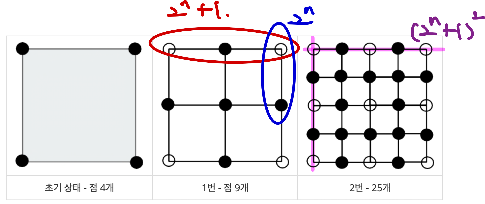

# [Bronze III] 중앙 이동 알고리즘 - 2903

[문제 링크](https://www.acmicpc.net/problem/2903)

### 성능 요약

메모리: 9600 KB, 시간: 124 ms

### 풀이



한 줄의 사각형의 갯수 = `2 ** N`
한 줄의 꼭짓점의 갯수 = 한 줄의 사각형의 갯수 + 1 = `2 ** n + 1`
총 꼭짓점의 갯수 = 한 줄의 꼭짓점의 갯수 ** 2 = `(2 ** n + 1) \*\* 2`

```javascript
let N = Number(require('fs').readFileSync('/dev/stdin').toString().trim());
console.log((2 ** N + 1) ** 2);
```
