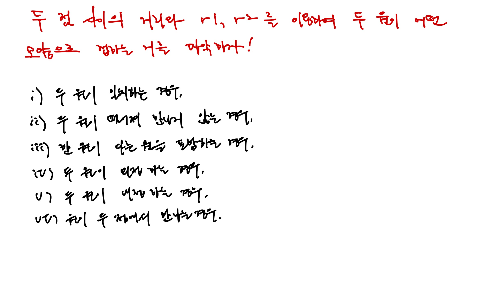
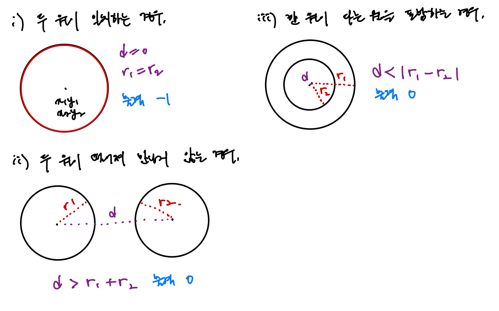

# [Silver III] 터렛 - 1002

[문제 링크](https://www.acmicpc.net/problem/1002)

### 성능 요약

메모리: 9480 KB, 시간: 112 ms

### 분류

많은 조건 분기, 기하학, 수학

## 목차

-   [🤔 접근법](#접근법)
-   [👨🏻‍💻 구현 및 풀이](#구현-및-풀이)
-   [🫢 배운점](#배운점)

### 접근법





### 구현 및 풀이

```javascript
const input = require('fs')
    .readFileSync('/dev/stdin')
    .toString()
    .trim()
    .split('\n')
    .slice(1)
    .map((el) => {
        const [x1, y1, r1, x2, y2, r2] = el.split(' ').map(Number);

        const p1 = { x: x1, y: y1 };
        const p2 = { x: x2, y: y2 };

        const d = distance(p1, p2);
        const spot = checkPoint(d, r1, r2);
        return spot;
    });

function distance(p1, p2) {
    return (p1.x - p2.x) ** 2 + (p1.y - p2.y) ** 2;
}

function checkPoint(d, r1, r2) {
    const sum = (r1 + r2) ** 2;
    const sub = (r1 - r2) ** 2;

    if (d < sum && d > sub) {
        return 2;
    } else if (d === sum || (d === sub && d !== 0)) {
        return 1;
    } else if (d > sum || d < sub) {
        return 0;
    } else if (d === 0) {
        if (r1 === r2) {
            return -1;
        } else {
            return 0;
        }
    }
}

console.log(input.join('\n'));
```

### 배운점
