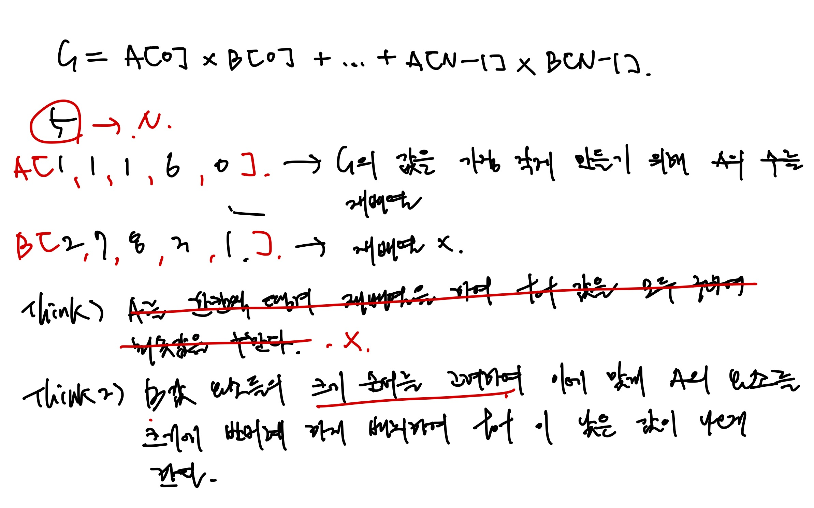
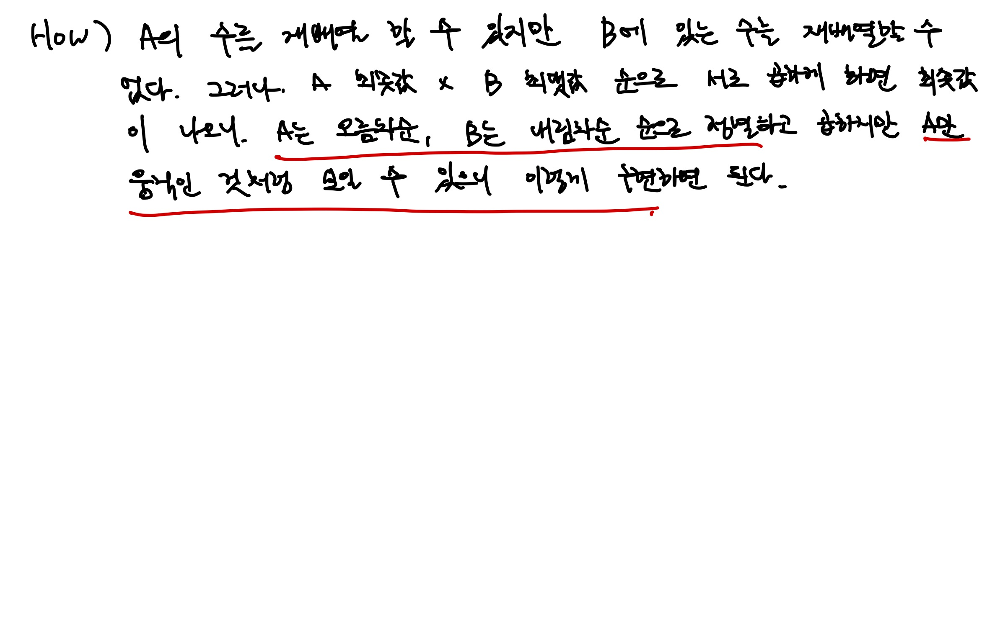

# [Silver IV] 보물 - 1026

[문제 링크](https://www.acmicpc.net/problem/1026)

### 성능 요약

메모리: 9592 KB, 시간: 128 ms

### 분류

그리디 알고리즘, 수학, 정렬

## 목차

-   [🤔 접근법](#접근법)
-   [👨🏻‍💻 구현 및 풀이](#구현-및-풀이)
-   [🫢 배운점](#배운점)

### 접근법

다음 접근 방법을 통해 풀었다.




A와 B의 배열들의 요소를 서로 곱하는데 서로의 최소값 순서와 최대값 순서를 서로 곱하면 되겠다는 생각이 들어서 해당 접근방법으로 풀었다.

그래서 A배열을 오름차순 정렬, B 배열을 내림차순 정렬을 하여 곱을 해주어 최소값을 구했고, 이는 A 배열이 B 배열에 맞춰 A배열을 정렬한 후 곱한 것의 합으로 볼 수 있기에 가능하였다.

`B에 있는 수는 재배열하면 안된다` 라는 조건에 의해서 많은 생각을 했던 문제였던 것 같다.

### 구현 및 풀이

```javascript
const [N, A, B] = require('fs')
    .readFileSync('/dev/stdin')
    .toString()
    .trim()
    .split('\n');

function solution(n, alist, blist) {
    const N = +n;
    const A = alist
        .split(' ')
        .map(Number)
        .sort((a, b) => a - b);
    const B = blist
        .split(' ')
        .map(Number)
        .sort((a, b) => b - a);

    let tot = 0;

    for (let i = 0; i < N; i++) {
        tot += A[i] * B[i];
    }

    return tot;
}

const answer = solution(N, A, B);
console.log(answer);
```

### 배운점
