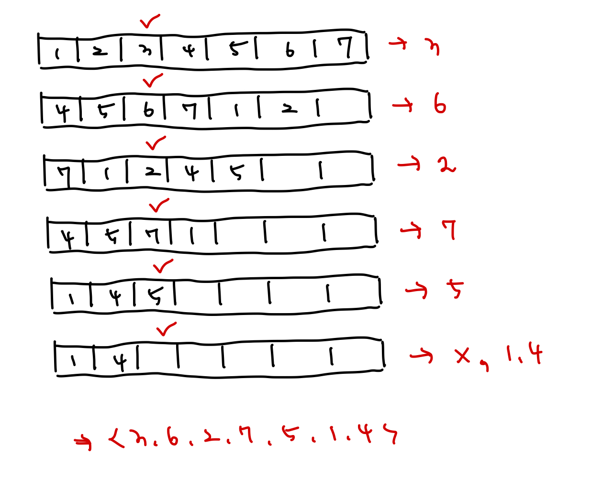

# [Silver IV] 요세푸스 문제 - 1158

[문제 링크](https://www.acmicpc.net/problem/1158)

### 성능 요약

메모리: 18096 KB, 시간: 2644 ms

### 분류

자료 구조, 구현, 큐

## 목차

- [🤔 접근법](#접근법)
- [👨🏻‍💻 구현 및 풀이](#구현-및-풀이)
- [🫢 배운점](#배운점)

### 접근법



### 구현 및 풀이

큐 방식을 사용해서 풀었다. N 개의 크기의 1부터 N까지 채운 queue 배열을 만들고, 요세푸스 순열 결과값을 담을 josephus 배열을 만들었다. 그리고 인덱스값을 조회할 때 사용할 cnt 변수를 선언해주었다.

while문을 통해서 반복되도록 설계했으며 shift()를 사용해 queue의 앞의 값을 뽑아내어 shiftItem에 담았다.

cnt 에 target 값을 나눴을 때 나머지가 0, 즉 target 번째 사람 차례일 경우 josephus에 shiftItem 값을 push() 해주며 cnt 값을 1로 초기화된다. 반면 그렇지 않을 경우 queue에 다시 shiftItem을 push()해주어 큐의 꼬리부분으로 들어가게 된다. 그리고 cnt 에 1을 더해 단계를 계속해서 검사한다.

값을 계속 검사하고 뽑아내면서 queue의 길이가 0이 되면 while문은 종료되며, josephus 배열에 담긴 값들을 출력해준다. 다만 출력 형태가 "<" , ">"으로 이에 맞게 구현하였다.

```javascript
const [N, K] = require('fs').readFileSync('/dev/stdin').toString().trim().split(' ').map(Number);

function solution(size, target) {
  const queue = new Array(size).fill().map((_, i) => i + 1);
  const josephus = [];
  let cnt = 1;

  while (queue.length) {
    const shiftItem = queue.shift();
    if (cnt % target === 0) {
      josephus.push(shiftItem);
      cnt = 1;
    } else {
      queue.push(shiftItem);
      cnt++;
    }
  }

  console.log(`<${josephus.join(', ')}>`);
}

solution(N, K);
```

### 배운점

큐 관련 문제를 처음 풀어보는데 이번 문제를 통해 큐 구조를 이해할 수 있었다.
관련 문제를 더 풀어보고 자유자재로 쓸 수 있도록 만들어야겠다.
