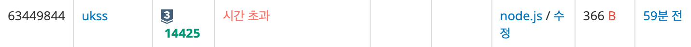

# [Silver III] 문자열 집합 - 14425

[문제 링크](https://www.acmicpc.net/problem/14425)

### 성능 요약

메모리: 33392 KB, 시간: 224 ms

### 분류

자료 구조, 해시를 사용한 집합과 맵, 문자열, 트리를 사용한 집합과 맵

## 목차

-   [🤔 접근법](#접근법)
-   [👨🏻‍💻 구현 및 풀이](#구현-및-풀이)
-   [🫢 배운점](#배운점)

### 접근법

처음에는 다음과 같이 풀었다.

```jsx
const [first, ...list] = require('fs').readFileSync('/dev/stdin').toString().trim().split('\n');
const [N, M] = first.split(' ').map(Number);

const S = list.splice(0, N);

let ans = 0;

for (let i = 0; i < M; i++) {
    const test = list[i];

    for (let j = 0; j < N; j++) {
        const check = S[j];

        test === check && ans++;
    }
}

console.log(ans);
```

그러나 다음과 같은 결과가 나왔다.



집합 S에 같은 문자열이 여러번 주어지는 경우가 없다는 조건을 놓쳤으며, 전체를 순회하며 검사를 하기에 시간 복잡도가 O(n)이 나와 시간 초과가 나온것 같다. 그래서 Set() 을 사용해서 중복 제거를 하였고, has() 를 사용해서 값만 존재하는 것 만 뽑아 있을 경우 ans 에 값을 더해 정답을 유도하였다. (시간 복잡도 O(1))

### 구현 및 풀이

```javascript
const [first, ...list] = require('fs').readFileSync('/dev/stdin').toString().trim().split('\n');
const [N] = first.split(' ').map(Number);

const candidate = list.splice(0, N);
const set = new Set(candidate);

let ans = 0;

list.forEach((el) => {
    if (set.has(el)) {
        ans++;
    }
});

console.log(ans);
```

### 배운점

Set() !!!
