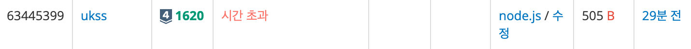

# [Silver IV] 나는야 포켓몬 마스터 이다솜 - 1620

[문제 링크](https://www.acmicpc.net/problem/1620)

### 성능 요약

메모리: 69536 KB, 시간: 396 ms

### 분류

자료 구조, 해시를 사용한 집합과 맵

## 목차

-   [🤔 접근법](#접근법)
-   [👨🏻‍💻 구현 및 풀이](#구현-및-풀이)
-   [🫢 배운점](#배운점)

### 접근법

처음에는 다음과 같이 풀었다.

```javascript
const [first, ...list] = require('fs').readFileSync('/dev/stdin').toString().trim().split('\n');
const [N, M] = first.split(' ').map(Number);
const question = list.splice(list.length - M, M).map((el) => {
    if (!isNaN(el)) {
        return Number(el);
    } else {
        return el;
    }
});

const ans = [];

for (let item of question) {
    if (typeof item === 'number') {
        ans.push(list[item - 1]);
    } else {
        ans.push(list.indexOf(item) + 1);
    }
}

console.log(ans.join('\n'));
```

그러나 다음과 같은 결과가 나왔다.



시간 초과가 발생한 이유는 시간복잡도가 O(n) 이 나와 제한된 시간을 넘긴 것 같다. 해쉬 테이블을 사용해서 이를 해결할 수 있었다. 다음 경우에는 배열 전체를 순회하는 것이 아니라, 키와 값이 짝을 이루어 일치한 것만 쏙 뽑아 값을 변화해줄 수 있기에 시간 복잡도를 O(1) 로 단축시킬 수 있었다.

### 구현 및 풀이

```javascript
const [first, ...list] = require('fs').readFileSync('/dev/stdin').toString().trim().split('\n');
const [N, M] = first.split(' ').map(Number);

const numToKey = new Map();
const nameToKey = new Map();

for (let i = 0; i < N; i++) {
    numToKey.set(i + 1, list[i]);
    nameToKey.set(list[i], i + 1);
}

const question = list.splice(list.length - M, M).map((el) => {
    if (!isNaN(el)) {
        return numToKey.get(+el);
    } else {
        return nameToKey.get(el);
    }
});

console.log(question.join('\n'));
```

### 배운점

해쉬 테이블을 사용해서 더욱 빠르게 원하는 값을 도출해낼 수 있었다 !
