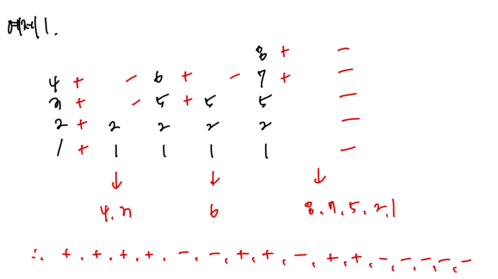
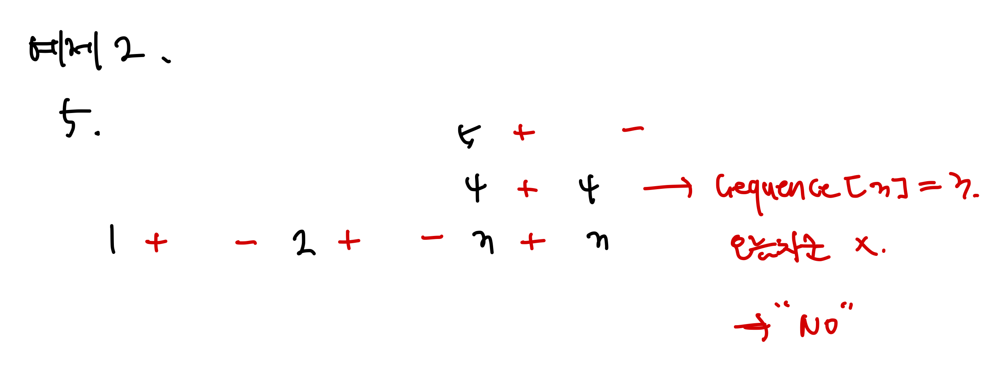

# [Silver II] 스택 수열 - 1874

[문제 링크](https://www.acmicpc.net/problem/1874)

### 성능 요약

메모리: 39036 KB, 시간: 260 ms

### 분류

자료 구조, 스택

## 목차

- [🤔 접근법](#접근법)
- [👨🏻‍💻 구현 및 풀이](#구현-및-풀이)
- [🫢 배운점](#배운점)

### 접근법

스택을 사용해서 푼 문제이다.

1부터 n까지의 수를 스택에 넣었다가 뽑아 늘어놓으면서 하나의 수열을 만드는데, 해당 스택에 push 하는 순서는 오름차순을 지키도록 하는 문제이다.

그래서 입력에 넣은 리스트들을 하나씩 뽑는데, 리스트에서 뺀 수만큼 스택을 쌓고, 따로 만든 변수가 해당 수를 넘었을 때 스택에서 값을 빼는 식으로 구현했다. 다만 리스트의 값과 쌓은 값과 비교를 해서 빼는데 이에 다를 경우 NO 출력을 해서 불가능한 경우를 구현했다.

더 쉽게 설명하자면 다음과 같다.

input의 순서대로 수열을 만들어내기 위해서는 stack을 조작해야 한다.

for문을 보면 리스트에서 숫자를 하나씩 꺼낸다. stack 배열에 1부터 리스트에서 꺼낸 수까지 cnt 값을 증가시키면서 stack에 넣어준다. 이와 동시에 command 배열에 + 문자를 넣어준다. 예제 문제에서 4를 먼저 꺼내기에 sequence[0] 은 4, 배열은 [1,2,3,4]가 된다.

여기서 while 반복문을 종료시켜 stack 을 그만 쌓고 현재 cnt와 sequence[0]은 값이 4로 동일해지기에 이를 stack에서 pop으로 값을 뽑아주고, command 에 - 문자를 넣어준다.

다시 i가 증가하고 이번에는 sequence[1] = 3 이다. 이미 cnt가 sequence[1] 보다 크기에 (5 > 3) 패스하고 바로 stack에서 pop으로 값을 뽑아주고, command 에 - 문자를 넣어준다.

이렇게 반복하면서 수열을 만들어가는 식으로 문제를 해결했다.

그런데 두번째 예제를 보면 sequence[3] = 3 인 상황에서 stack 은 [3,4] 이며, 여기서 stack에서 pop 을 하면 4가 나오며, 이를 비교하면 sequence[3] = 4 가 나와야 맞는 상황이다. 즉 오름차순 규칙을 어겼다고 볼 수 있다. 그래서 popItem 이랑 sequence[i] 값이 다르면 command 에 NO 값을 넣어 오류를 찾을 수 있도록 만들었다.

**예제1 풀이**



**예제2 풀이**



### 구현 및 풀이

```javascript
const input = require('fs').readFileSync('/dev/stdin').toString().trim().split('\n').map(Number);

const [n, ...sequence] = input;

function solution(num, list) {
  const stack = [];
  let command = [];
  let cnt = 1;

  for (let i = 0; i < list.length; i++) {
    while (cnt <= sequence[i]) {
      stack.push(cnt);
      command.push('+');
      cnt++;
    }

    const popItem = stack.pop();
    command.push('-');

    if (popItem !== list[i]) {
      command = ['NO'];
      break;
    }
  }
  return command.join('\n');
}

const answer = solution(n, sequence);
console.log(answer);
```

### 배운점
