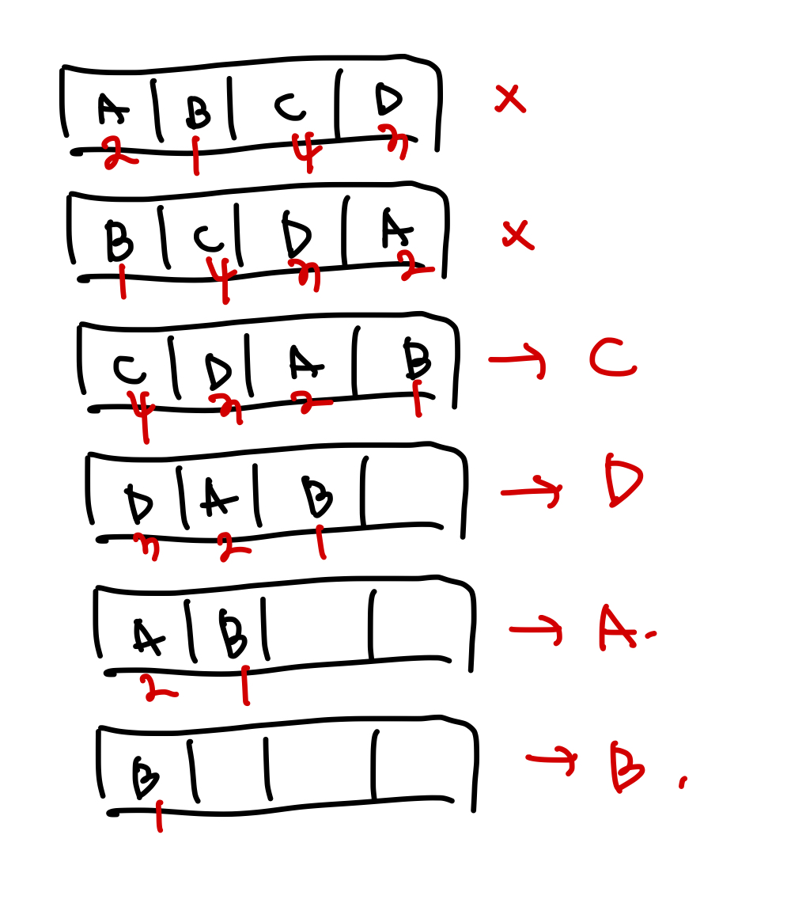
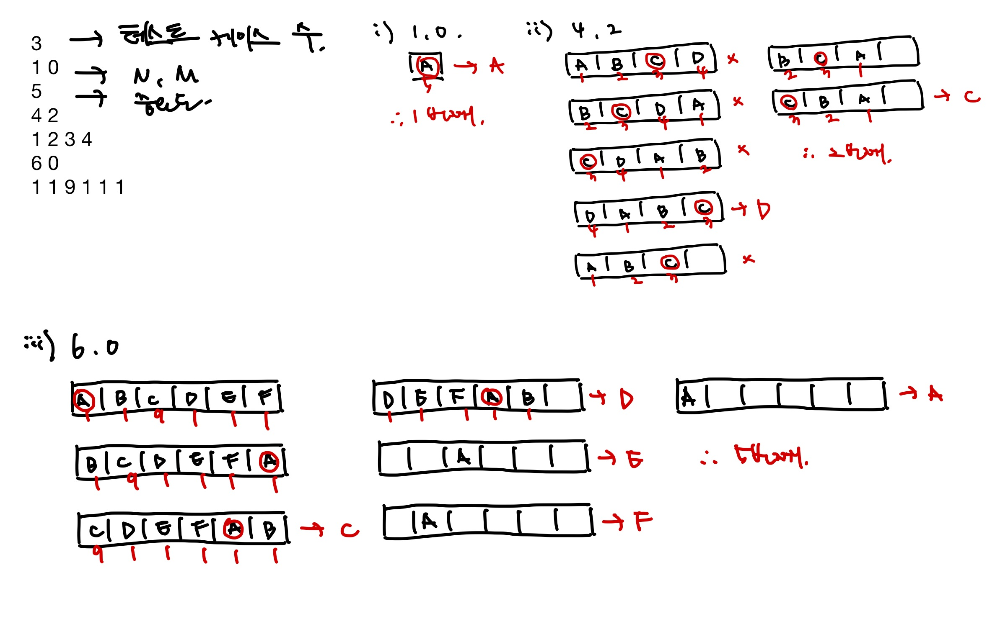

# [Silver III] 프린터 큐 - 1966

[문제 링크](https://www.acmicpc.net/problem/1966)

### 성능 요약

메모리: 11352 KB, 시간: 144 ms

### 분류

자료 구조, 구현, 큐, 시뮬레이션

## 목차

- [🤔 접근법](#접근법)
- [👨🏻‍💻 구현 및 풀이](#구현-및-풀이)
- [🫢 배운점](#배운점)

### 접근법

예를 들어 Queue에 4개의 문서(A B C D)가 있고, 중요도가 2 1 4 3 라면 C를 인쇄하고, 다음으로 D를 인쇄하고 A, B를 인쇄하게 된다.



예제 입력 1 풀이



### 구현 및 풀이

큐를 사용하여 해결한 문제이다.

테스트케이스 수를 splice를 통해 구함과 동시에 input에서 빼주고, 나머지 input을 기준으로 while()을 돌렸다.

테스트케이스의 첫번째 줄과, 두번째 줄만 뽑아줄 testCase 변수를 만들었고, 이들을 활용해 N, M, 그리고 중요도를 담아줄 queue 배열과, 비교군을 위한 checkQueue 배열을 만들어주었다. 몇 번째로 인쇄되었는지 궁금한 문서를 check에 담았다.
(queue 배열만으로 비교하기엔 중요도가 중복된 것도 있을 수 있기에 checkQueue를 만들어줌)

우선 queue와 checkQueue 배열에서 각각 앞쪽에서 값을 뽑았고(shiftItem, shiftCheck) queue에서 뽑은 값이 중요도 최고값이라면 checkAnswer 뒤에 방금 뽑은 shiftCheck 값을 넣는다. (출력)
그렇지 않을 경우 queue와 checkQueue에 앞서 뽑은 값들을 다시 뒤에 넣어서 검사를 이어나간다.

queue 배열에 있는 값이 0이 되면 반복문이 종료되어 checkAnswer 배열에서 앞서 몇 번째로 인쇄되었는지 궁금한 문서의 값이 담긴 check의 인덱스 값을 뽑아 + 1 한 값을 출력한다. (몇 번째로 출력되는지를 나타냄, +1은 인덱스는 0부터 시작하기에)

```javascript
const input = require('fs').readFileSync('/dev/stdin').toString().trim().split('\n');

const testCaseCnt = +input.splice(0, 1);

while (input.length) {
  const testCase = input.splice(0, 2);
  const [N, M] = testCase[0].split(' ').map(Number);
  const queue = new Array(N).fill().map((_, i) => testCase[1].split(' ').map(Number)[i]);
  const checkQueue = new Array(N).fill().map((_, i) => i);
  const check = checkQueue[M];
  const checkAnswer = [];

  while (queue.length) {
    const importance = Math.max(...queue);
    const shiftItem = queue.shift();
    const shiftCheck = checkQueue.shift();
    if (shiftItem === importance) {
      checkAnswer.push(shiftCheck);
    } else {
      queue.push(shiftItem);
      checkQueue.push(shiftCheck);
    }
  }
  console.log(checkAnswer.indexOf(check) + 1);
}
```

### 배운점
