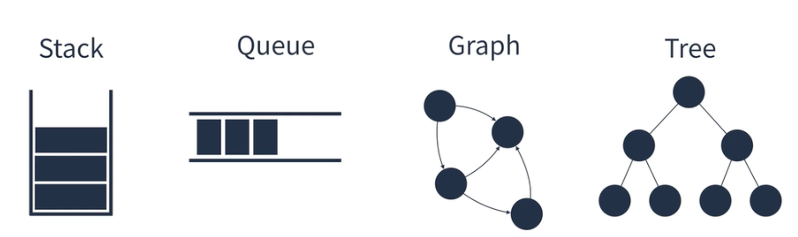
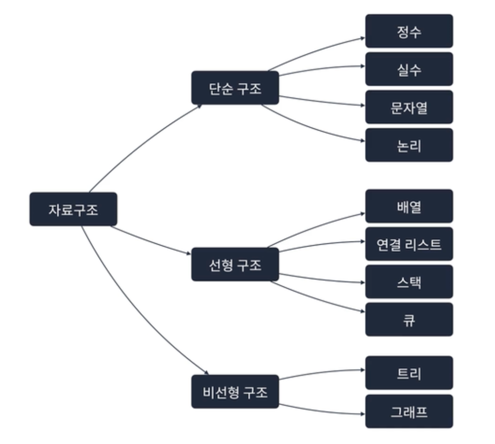
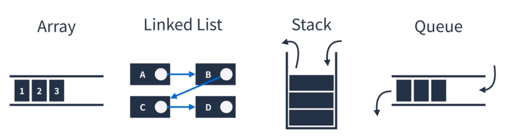
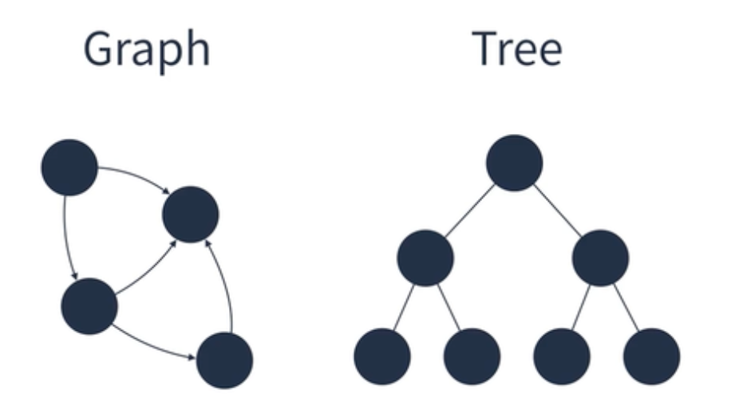

# 자료구조의 종류

> [프로그래머스 코딩테스트 광탈 방지 A to Z : JavaScript 강의](https://school.programmers.co.kr/learn/courses/13213/13213-%EC%BD%94%EB%94%A9%ED%85%8C%EC%8A%A4%ED%8A%B8-%EA%B4%91%ED%83%88-%EB%B0%A9%EC%A7%80-a-to-z-javascript) 를 보고 참고하여 정리한 내용입니다.

## Table of Contents

- [자료구조](#자료구조)
- [무엇을 고려해야 하는가](#무엇을-고려해야-하는가)
- [자료구조의 종류](#자료구조의-종류)
- [선형 구조](#선형-구조)
- [비선형 구조](#비선형-구조)

### 자료구조

메모리를 효율적으로 사용하며 빠르고 안정적으로 데이터를 처리하는 것이 궁극적인 목표로, 상황에 따라 유용하게 사용될 수 있도록 **특정 구조**를 이루고 있다.

### 무엇을 고려해야 하는가?

주제 : 영화관

- 현실에서 수행되는 프로세스는?

1. 고객은 어떤 영화를 볼 지 고른다.
2. 고객은 영화를 예매하기 위해 줄을 선다.
3. 고객은 차례가 왔을 때 좌석을 선택한다.
4. 고객은 최종적으로 돈을 지불한다.

- **소프트웨어**에서는 어떻게 처리할 것인가?

1. 영화를 검색한다. → Trie
2. 고객이 많을 경우 줄을 서야 한다. → Queue
3. 고객은 좌석을 선택할 수 있어야 한다. → Hash Table

> 결국 자료구조는 **일차원인 컴퓨터 메모리를 현실에 대응되도록 구조를 만든 것** 이라 할 수 있다.

### 자료구조의 종류

1. 단순 구조
   정수, 실수, 문자열, 논리
2. 선형 구조
   배열, 연결 리스트, 스택, 큐
3. 비선형 구조
   트리, 그래프

### 선형 구조

**한 원소 뒤에 하나의 원소만이** 존재하는 형태로, 자료들이 선형으로 나열되어 있는 구조를 가진다.
선형 구조에 해당되는 자료구조는 배열, 연결 리스트, 스택, 큐 등이 있다.

### 비선형 구조

원소 간 다대다 관계를 가지는 구조로 **계층적 구조나 망형 구조**를 표현하기에 적절하다.
비선형 구조에 해당되는 자료구조는 트리와 그래프 등이 있다.

> **완벽한 자료구조는 없다**   특정 상황에서 유용한 자료구조와 덜 유용한 자료구조가 존재할 뿐, 즉 우리는 **상황에 맞게** 적절한 자료구조를 선택하면 된다.
