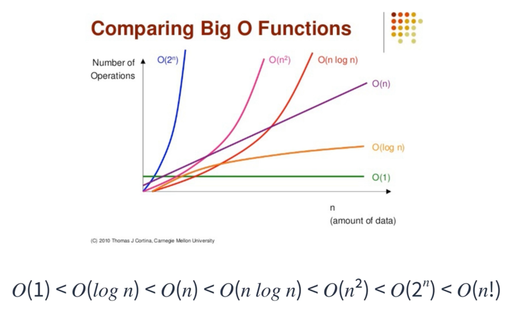
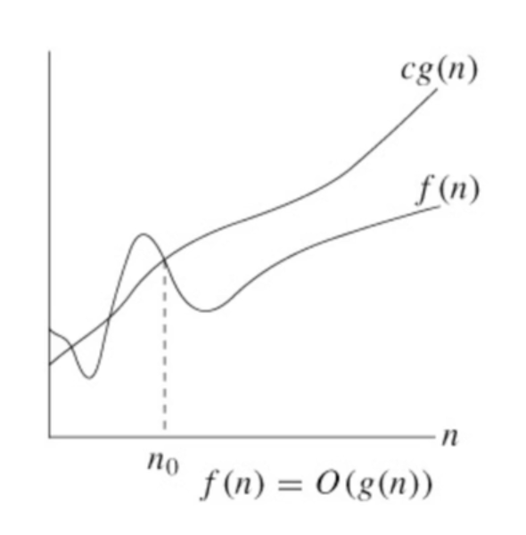
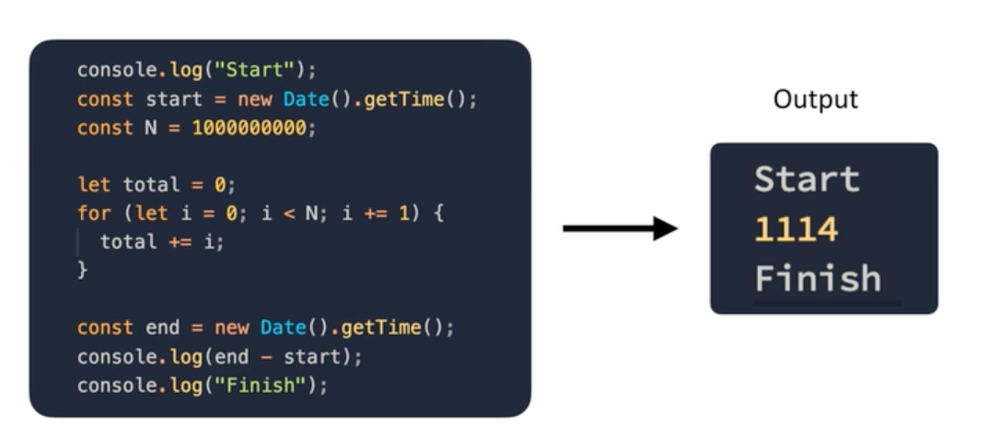

# 시간복잡도

> [프로그래머스 코딩테스트 광탈 방지 A to Z : JavaScript 강의](https://school.programmers.co.kr/learn/courses/13213/13213-%EC%BD%94%EB%94%A9%ED%85%8C%EC%8A%A4%ED%8A%B8-%EA%B4%91%ED%83%88-%EB%B0%A9%EC%A7%80-a-to-z-javascript) 를 보고 참고하여 정리한 내용입니다.

## Table of Contents

- [시간 복잡도](#시간-복잡도)
- [빅오 표기법](#빅오-표기법)
- [계수 법칙](#계수-법칙)
- [합의 법칙](#합의-법칙)
- [곱의 법칙](#곱의-법칙)
- [다항 법칙](#다항-법칙)
- [정리](#정리)
- [성능 측정 방법](#성능-측정-방법)

### 시간 복잡도

입력 크기, 하드웨어 성능, 운영체제 성능, 컴파일러 최적화, 비동기 로직 등등...
즉, **프로그램의 성능을 정확히 파악하는 것은 불가능하다.**

그로 인해 이러한 성능을 파악하기 위한 **상대적인 표기법**을 사용하기로 했는데 이를 **빅오 표기법(Big-O)**를 사용해 시간 복잡도를 나타낸다.

### 빅오 표기법

다음 그래프는 빅오 표기법의 상대적인 성능을 비교해 시각화한 차트이다.



**O(n)**

```jsx
for (let i = 0; i < n; i += 1) {
  // ...
}
```

**O(log n)**

```jsx
for (let i = 1; i <= n; i *= 2) {
  // ...
}
```

**O(n log n)**

```jsx
for (let i = 0; i < n; i += 1) {
  for (let j = 1; j <= n; j *= 2) {
    // ...
  }
}
```

**O(n^2)**

```jsx
for (let i = 0; i < n; i += 1) {
  for (let j = 0; j < n; j += 1) {
    // ...
  }
}
```

> 코딩테스트에서 적어도 O(n^3) 이상의 시간복잡도가 소요되는 경우는 거의 없을 것이다.

빅오 표기법은 **점근적 표기법**을 따른다



위의 그래프를 보면 n이 n0를 넘어설 때 f(n)은 g(n)에 한없이 가까워 질 수는 있어도 넘어설 수는 없다.
한마디로 함수 g(n)은 f(n)의 한계치라 할 수 있다.

### 계수 법칙

상수 k가 0보다 클 때 `f(n) = O(g(n))`이면 `kf(n) = O(g(n))`이다.
**n이 무한에 가까울 수록 k의 크기는 의미가 없기 때문이다.**

```jsx
// 두 루프는 같은 O(n)으로 표기된다.
for (let i = 0; i < n; i += 1) {
  // ...
}

for (let i = 0; i < n * 5; i += 1) {
  // ...
}
```

### 합의 법칙

`f(n) = O(h(n))`이고 `g(n) = O(p(n))`이면 `f(n) + g(n) = O(h(n)) + O(p(n))` 이다.
**빅오는 더해질 수 있다**

```jsx
// 두 루프를 합쳐 O(n + m)으로 표기할 수 있다.
// 계수 법칙에 의해 5는 사라진다.
for (let i = 0; i < n; i += 1) {
  // ...
}

for (let i = 0; i < m * 5; i += 1) {
  // ...
}
```

### 곱의 법칙

`f(n) = O(h(n))`이고 `g(n) = O(p(n))`이면 `f(n) * g(n) = O(h(n)) * O(p(n))` 이다.
**빅오는 곱해질 수 있다**

```jsx
// 두 루프를 합쳐 O(n^2)으로 표기할 수 있다.
// 계수 법칙에 의해 5는 사라진다.
for (let i = 0; i < n; i += 1) {
  for (let j = 0; j < n * 5; j += 1) {
    // ...
  }
}
```

### 다항 법칙

`f(n)`이 k차 다항식이면 `f(n)`은 `O(n^k)` 이다.

```jsx
// 다음 루프는 O(n^3)으로 표기할 수 있다.
for (let i = 0; i < n * n * n; i += 1) {
  // ...
}
```

### 정리

2가지만 기억하라

1. 상수항은 무시

```jsx
// 계수 법칙에 의해 계수는 무시된다.
// 그리하여 O(n + m)으로 표기된다.
for (let i = 0; i < n * 6; i += 1) {
  // ...
}

for (let i = 0; i < m * 3; i += 1) {
  // ...
}
```

2. 가장 큰 항 외엔 무시

```jsx
// O(n^2 + n)이지만 작은 항은 무시하여
// O(n^2) 으로만 표기해도 된다.
for (let i = 0; i < n; i += 1) {
  // ...
}

for (let i = 0; i < n; i += 1) {
  for (let j = 0; j < n; j += 1) {
    // ...
  }
}
```

### 성능 측정 방법

Date 객체를 이용

```jsx
const start = new Date().getTime();

// ...

const end = new Date().getTime();
console.log(end - start);
```

다음과 같이 Date 객체를 이용해 대략적인 성능을 측정해볼 수 있다.


