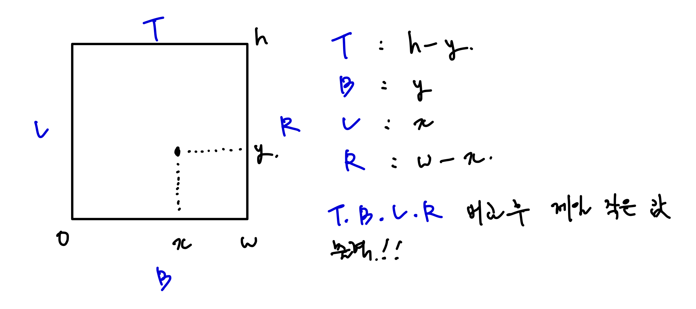

# [Bronze III] 직사각형에서 탈출 - 1085

[문제 링크](https://www.acmicpc.net/problem/1085)

### 성능 요약

메모리: 9332 KB, 시간: 120 ms

## 목차

- [🤔 문제 풀이](#문제-풀이)
  - [😮 문제를 이해하기](#문제를-이해하기)
  - [✍🏻 이해한 것을 나의 언어로 써보기](#이해한-것을-나의-언어로-써보기)
  - [👨🏻‍💻 구현 및 풀이](#구현-및-풀이)
  - [🫢 배운점](#배운점)

## 문제 풀이

### 문제를 이해하기

왼쪽 아래 꼭짓점이 (0,0), 오른쪽 위 꼭짓점이 (w,h)일 경우 가로 w, 세로 h 인 직사각형으로 볼 수 있다.



### 이해한 것을 나의 언어로 써보기

`Math.min()`을 사용하여 구한 값들의 최소값을 출력

### 구현 및 풀이

```javascript
const [x, y, w, h] = require('fs').readFileSync('/dev/stdin').toString().trim().split(' ').map(Number);

let top = h - y;
let bottom = y;
let left = x;
let right = w - x;

console.log(Math.min(top, bottom, left, right));
```

### 배운점
