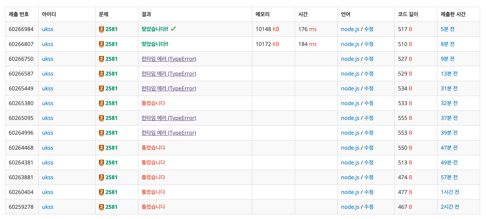

# [Bronze II] 소수 - 2581

[문제 링크](https://www.acmicpc.net/problem/2581)

### 성능 요약

메모리: 10148 KB, 시간: 176 ms

## 목차

- [🤔 문제 풀이](#문제-풀이)
  - [😮 문제를 이해하기](#문제를-이해하기)
  - [✍🏻 이해한 것을 나의 언어로 써보기](#이해한-것을-나의-언어로-써보기)
  - [👨🏻‍💻 구현 및 풀이](#구현-및-풀이)
  - [🫢 배운점](#배운점)

## 문제 풀이

### 문제를 이해하기

M과 N이 주어질 때 M이상 N이하의 자연수 중 소수인 것을 골라 이들 소수의 합과 최솟값을 찾는 프로그램 제작

### 이해한 것을 나의 언어로 써보기

M부터 N까지 뽑아낼 수 있는 for문을 실행 후 for문 안에 소수만을 골라낼 수 있는 조건을 제작, 조건을 통과하면 해당 숫자를 임시 배열에 담아낸다.

배열에 담긴 숫자들을 `reduce()` 를 사용해서 더하고, 배열에서 정렬을 통해 최솟값을 구해내 이를 출력하는 식으로 제작

### 구현 및 풀이

sosuCheck 라는 변수를 생성해서 n이 1일 경우 false, 그리고 n이 i로 나눠질 경우 false, 그렇지 않다면 true를 내보내는 소수 판별 알고리즘을 만들었다.

이를 M에서 N까지 꺼내주는 반복문에서 해당 알고리즘을 사용해서 값을 판별했고, 소수일 경우 배열에 담아주는 식으로 범위 내에 존재하는 소수들을 모았다.

`reduce()`를 사용해서 소수들의 총합, 그리고 `Math.min()`을 사용해서 최솟값을 구해냈으며, 범위 내의 소수 존재여부는 소수를 담아낸 배열의 길이로 판단하여 없을 경우 -1, 존재할 경우 총합, 최소값을 출력할 수 있도록 설계했다.

```javascript
const [M, N] = require('fs').readFileSync('/dev/stdin').toString().trim().split('\n').map(Number);

let sosu = [];

const sosuCheck = (n) => {
  if (n === 1) {
    return false;
  }
  for (let i = 2; i <= Math.sqrt(n); i++) {
    if (n % i === 0) {
      return false;
    }
  }
  return true;
};

for (let i = M; i <= N; i++) {
  sosuCheck(i) && sosu.push(i);
}

let sumResult = sosu.reduce((sum, cur) => sum + cur, 0);
let minResult = Math.min(...sosu);
console.log(sosu.length ? `${sumResult}\n${minResult}` : -1);
```

### 배운점



사실 알고리즘은 틀린게 없었다고 생각했는데 계속해서 런타임 에러가 발생했다.

알고보니 `reduce()`를 사용할 때 초기값을 입력해주지 않아서 발생한 에러였다.

_코드를 유심히 보자 !!_
