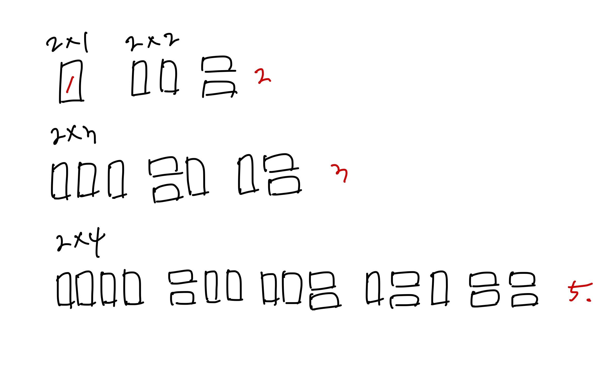

# [Silver III] 2×n 타일링 - 11726

[문제 링크](https://www.acmicpc.net/problem/11726)

### 성능 요약

메모리: 9640 KB, 시간: 196 ms

### 분류

다이나믹 프로그래밍

## 목차

-   [🤔 접근법](#접근법)
-   [👨🏻‍💻 구현 및 풀이](#구현-및-풀이)
-   [🫢 배운점](#배운점)

### 접근법



위의 그림을 통해 dp를 사용해서 다음과 같은 공식을 유도할 수 있었다.

`dp[i] = dp[i-1] + dp[i-2]`

### 구현 및 풀이

```javascript
const input = +require('fs').readFileSync('/dev/stdin').toString().trim();

function solution(n) {
    const dp = new Array(n + 1).fill(0);
    dp[1] = 1;
    dp[2] = 2;

    for (let i = 3; i <= n; i++) {
        dp[i] = (dp[i - 1] + dp[i - 2]) % 10007;
    }

    return dp[n];
}

const ans = solution(input);
console.log(ans);
```

### 배운점
