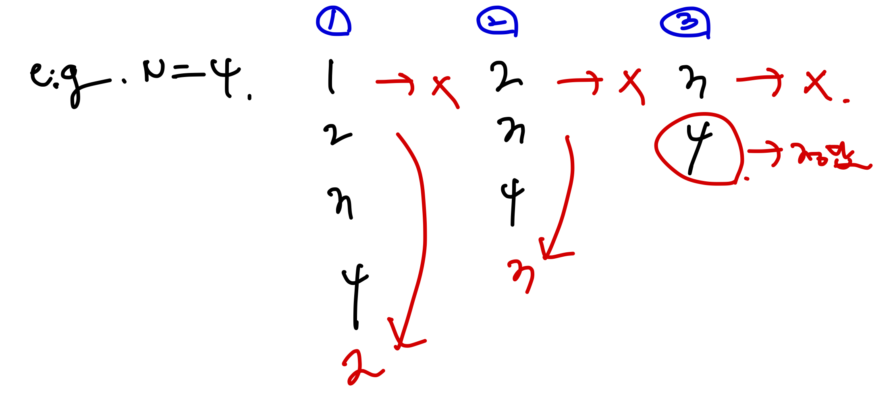

# [Silver IV] 카드2 - 2164

[문제 링크](https://www.acmicpc.net/problem/2164)

### 성능 요약

메모리: 89032 KB, 시간: 532 ms

### 분류

자료 구조, 큐

## 목차

- [🤔 접근법](#접근법)
- [👨🏻‍💻 구현 및 풀이](#구현-및-풀이)
- [🫢 배운점](#배운점)

### 접근법

큐를 사용해서 문제를 풀이하였다.

큐는 LinkedList 를 사용해 직접 구현해서 이를 풀었으며, 구현한 큐에 입력값 만큼의 카드를 넣었고, 반복문을 사용해 해당 조건을 구현했다.

조건을 그림으로 나타내면 다음과 같다.



우선 제일 앞(head)에 있는 값을 제거한 후, 두번째로 앞에 있는 값을 큐의 뒷(tail) 부분에 넣었다. 그런 다음 두번째 로 앞에 있는 값이 현재 제일 앞에 있기에 이를 제거해주는 방식으로 while 문을 설계했고, 해당 큐의 크기가 1이 되면 이를 종료시키도록 만들었다.

그래서 큐의 크기가 1일때 큐에 남아있는 값을 뽑아 이를 출력하는 식으로 구현했다.

### 구현 및 풀이

```javascript
const input = +require('fs').readFileSync('/dev/stdin').toString().trim();

class Node {
  constructor(item) {
    this.item = item;
    this.next = null;
    this.prev = null;
  }
}

class Queue {
  constructor() {
    this.head = null;
    this.tail = null;
    this.length = 0;
  }

  push(item) {
    const newNode = new Node(item);

    if (!this.head) {
      this.head = newNode;
    } else {
      this.tail.next = newNode;
      newNode.prev = this.tail;
    }
    this.tail = newNode;
    this.length++;
  }

  getHead() {
    return this.head.item;
  }

  removeHead() {
    this.head = this.head.next;
    this.head.prev = null;
    this.length--;
  }

  getSize() {
    return this.length;
  }
}

function solution(n) {
  const queue = new Queue();

  for (let i = 1; i <= n; i++) queue.push(i);

  while (queue.getSize() > 1) {
    queue.removeHead();
    queue.push(queue.getHead());
    queue.removeHead();
  }

  return queue.getHead();
}

const answer = solution(input);
console.log(answer);
```

### 배운점
